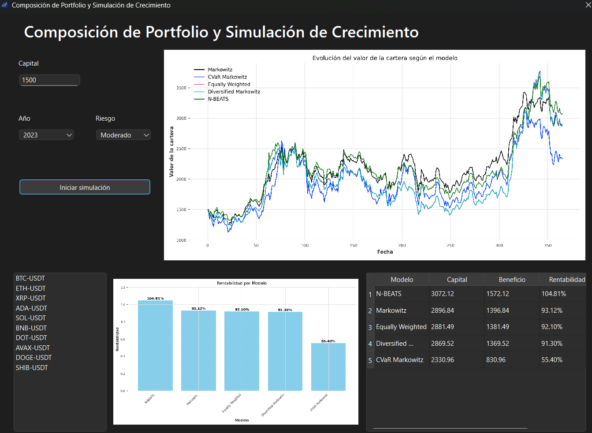

# Sistema para la Gestión de Carteras para Activos de Alta Volatilidad

### Aplicación a Criptomonedas

Este proyecto corresponde al Trabajo de Fin de Grado (TFG) del Grado en Ingeniería Informática. Su objetivo principal es ofrecer un sistema visual e interactivo que permita simular y comparar la evolución de carteras de criptomonedas utilizando diferentes modelos de asignación de activos, adaptado a activos de alta volatilidad.

## 🖥️ Interfaz Gráfica

La aplicación proporciona una interfaz gráfica desarrollada en Python que permite:

- Seleccionar un **capital inicial**, **año** y **nivel de riesgo**.
- Elegir las **criptomonedas** que compondrán la cartera.
- Ejecutar simulaciones para comparar modelos de optimización de carteras:
  - **Markowitz**
  - **CVaR Markowitz**
  - **Equally Weighted**
  - **Diversified Markowitz**
  - **N-BEATS** (modelo basado en redes neuronales)

### Ejemplo de la interfaz



En la parte central se muestra la **evolución temporal del valor de la cartera** según el modelo seleccionado como simulación si hubieramos realizado la inversión para cada modelo.En la parte inferior se encuentran:

- Una gráfica de **rentabilidad por modelo**.
- Una tabla con los resultados detallados: capital final, beneficio obtenido y rentabilidad (%) por modelo.

## 📦 Instalación

Para ejecutar correctamente el sistema, es necesario tener instalado Python 3.10 o superior y todas las librerías requeridas.

### 1. Clona este repositorio

```bash
git clone https://github.com/alejandrorodm/TFG
cd TFG
```

### 2. Crea un entorno virtual (opcional pero recomendado)

```bash
python -m venv venv
source venv/bin/activate     # En Linux/macOS
venv\Scripts\activate.bat    # En Windows
```

### 3. Instala las dependencias

```bash
pip install -r requirements.txt
```

> Si no tienes `pip` actualizado, puedes hacerlo con:
> `python -m pip install --upgrade pip`

## 🚀 Ejecución

Una vez instaladas todas las dependencias, puedes iniciar la aplicación ejecutando:

```bash
python gui.py
```

## 📊 Modelos incluidos

| Modelo                | Descripción                                                              |
| --------------------- | ------------------------------------------------------------------------- |
| Markowitz             | Optimización clásica de cartera con media-varianza.                     |
| CVaR Markowitz        | Optimización con medida de riesgo CVaR (Conditional Value at Risk).      |
| Equally Weighted      | Reparto equitativo del capital entre todos los activos seleccionados.     |
| Diversified Markowitz | Versión diversificada del modelo de Markowitz.                           |
| N-BEATS               | Modelo de deep learning para series temporales aplicado a la predicción. |

### Ejecución sin simulación

Para una ejecución en tiempo real (sin simulación), que considera datos desde el día actual hasta un año atrás, se utiliza el archivo `final_execution_weights.py`.

**Pasos clave:**

*   **Especificar criptomonedas:** En el archivo `final_execution_weights.py`, se deben especificar las criptomonedas deseadas.
*   **Verificación:** Es crucial verificar que estas criptomonedas estén listadas en KuCoin (ejemplo: `https://www.kucoin.com/trade/BTC-USDT`).
*   **Formato:** Asegúrate de añadir el sufijo `-USDT` a cada criptomoneda (por ejemplo, para Bitcoin, se introduciría `BTC-USDT`).

## ⚙️ Configuración de criptomonedas

Las pruebas realizadas con el sistema se han realizado utilizando **10 criptomonedas** para proporcionar un buen margen de diversificación si el modelo lo requiere, incluyendo monedas de distintas índoles.

Cabe destacar que se podrán usar **todas aquellas criptomonedas listadas en KuCoin**, pero por defecto, el sistema trabaja con las siguientes:

- BTC-USDT
- ETH-USDT
- XRP-USDT
- ADA-USDT
- SOL-USDT
- BNB-USDT
- DOT-USDT
- AVAX-USDT
- DOGE-USDT
- SHIB-USDT

Si se desea utilizar la interfaz gráfica con un conjunto distinto de criptomonedas, será necesario **modificar la variable `coins` dentro del archivo `gui.py`**.

### Ejemplo de modificación:

```python
coins = ['NEAR-USDT', 'ETH-USDT', 'XRP-USDT', 'ADA-USDT', 'SOL-USDT',
         'BNB-USDT', 'DOT-USDT', 'LTC-USDT', 'DOGE-USDT', 'SHIB-USDT']
```

## 📁 Estructura del proyecto

```
├── Marketdata.py               # Controla las peticiones de datos de precios, gestiona las fechas y almacena la información en hojas de cálculo
├── Portfolio.py                # Clase principal que gestiona la optimización de cartera con modelos matemáticos y el modelo N-BEATS
├── GUI.py                      # Proporciona la interfaz gráfica para la simulación y gestión de carteras
├── crypto_<año>_prices.xlsx    # Precios diarios en el año seleccionado para el estudio
├── crypto_<año>_returns.xlsx   # Retornos calculados a partir de los precios diarios
├── crypto_<año+1>_prices.xlsx  # Precios diarios del año seleccionado para la simulación
├── results/                    # Almacena los resultados generados tras cada simulación según año y riesgo
│   ├── crypto_<año>_portfolio.xlsx     # Porcentajes de inversión por activo y modelo
│   ├── final_portfolio_values.xlsx     # Valor final de la cartera tras la simulación
│   ├── portfolio_evolution.png         # Gráfico de evolución del valor de la cartera
│   ├── predicted_prices.png            # Gráfico de precios predichos por N-BEATS
│   ├── rentabilidad_por_modelo.png     # Gráfico de barras con rentabilidades por modelo
│   └── models/                         # Modelos entrenados de la red neuronal para cada criptomoneda
```

## 📚 Créditos

Este proyecto ha sido desarrollado como Trabajo de Fin de Grado en Ingeniería Informática.

Autor: **Alejandro Rodríguez Moreno**.
Tutor: Francisco de Asís Fernández Navarro.
Universidad: Universidad de Málaga
